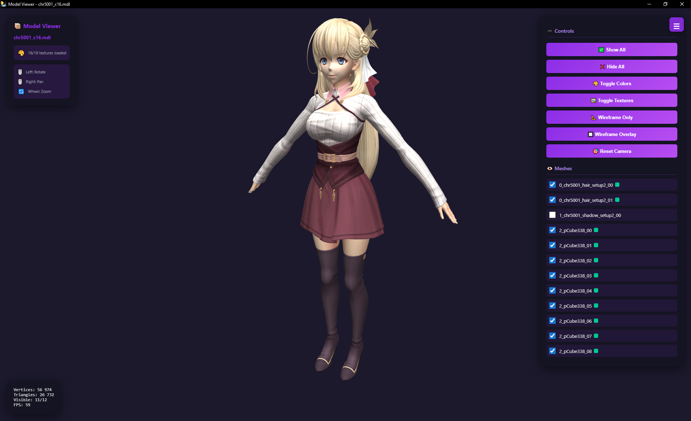

# KuroDLC Modding Toolkit

A comprehensive Python toolkit for creating and managing DLC mods for games using the KuroDLC format. This toolkit provides utilities for item discovery, ID management, conflict resolution, shop assignment automation, **schema conversion from KuroTools**, **ID allocation visualization**, and **3D model viewing**.

[](https://www.python.org/downloads/)
[](LICENSE)

**viewer_mdl_textured.exe**

new tool for quick preview of model. ideally associate exe with mdl file. for correct display of textures it looks for standard folder structure
```
└───asset
    ├───common
    │   └───model
    └───dx11
        └───image
```




> **⚠️ GPL-3.0 License Notice**  
> This project uses libraries from [eArmada8/kuro_dlc_tool](https://github.com/eArmada8/kuro_dlc_tool) which are licensed under GPL-3.0.  
> Therefore, this entire toolkit is also distributed under GPL-3.0 license.  
> See [License](#-license) section for details.

## 📋 Table of Contents

- [Why This Toolkit Exists](#-why-this-toolkit-exists)
- [Features](#-features)
- [Requirements](#-requirements)
- [Installation](#-installation)
- [Quick Start](#-quick-start)
- [Scripts Overview](#-scripts-overview)
- [Detailed Documentation](#-detailed-documentation)
- [Common Workflows](#-common-workflows)
- [File Formats](#-file-formats)
- [Troubleshooting](#-troubleshooting)
- [Best Practices](#-best-practices)
- [Version History](#-version-history)
- [External Dependencies](#-external-dependencies)
- [Contributing](#-contributing)
- [License](#-license)
- [Advanced Documentation](#-advanced-documentation) ⭐

---

## 🎯 Why This Toolkit Exists

### The Problem

When creating DLC mods for Kuro engine games, modders face multiple challenges:

**1. ID Conflicts (Primary Problem)**
- DLC mods use item IDs that may conflict with existing game items
- Manual ID conflict detection is tedious and error-prone
- A single conflicting ID can break your entire mod
- Game engine has a hard limit of 5000 IDs that cannot be expanded
- Finding safe, available ID ranges manually is time-consuming

**2. Shop Assignment Tedium (Secondary Problem)**
- Adding items to shops requires editing hundreds of entries manually
- Assigning 50 items to 10 shops = 500 manual entries
- Copy-paste errors are common
- No easy way to bulk-update shop assignments

**3. Schema Incompatibility (New Files Problem)**
- New TBL files from game updates don't have schema definitions
- KuroTools project supports new files but uses different format
- Manual schema conversion is complex and error-prone
- Missing schemas prevent reading new TBL files

**4. ID Range Planning (Visibility Problem)** ⭐ NEW
- No visual overview of which IDs are occupied vs. free
- Hard to find safe ID ranges for large mods
- Team coordination requires manual tracking
- Fragmentation analysis is impossible manually

**5. Model Preview (3D Visualization Problem)** ⭐ NEW
- No quick way to preview .mdl 3D models
- External tools required for model inspection
- Difficult to verify model integrity
- Time-consuming workflow for model checking

### The Solution

This toolkit automates all five problems:

**Primary: Automatic ID Conflict Resolution**
```bash
# One command to detect and fix all conflicts
python resolve_id_conflicts_in_kurodlc.py repair --apply
```
- Automatically finds safe IDs within the 5000 limit
- Smart distribution algorithm for better ID organization
- Detailed logging and automatic backups
- Manual control option for complex mods

**Secondary: Bulk Shop Assignment**
```bash
# Generate 500 shop assignments in seconds
python shops_find_unique_item_id_from_kurodlc.py my_mod.kurodlc.json --generate-template
python shops_create.py template_my_mod.json
```
- Batch assign items to multiple shops
- Customizable templates for different shop structures
- 50 items × 10 shops = 500 entries generated instantly

**Tertiary: Schema Conversion**
```bash
# Convert KuroTools schemas to kurodlc format
python convert_kurotools_schemas.py
```
- Automatically converts 280+ schemas from KuroTools
- Adds support for new TBL files (Kuro 1, 2, Kai, Ys X, Sky)
- Expands schema coverage from 39 to 344+ structures
- Works with local schemas folder (no internet needed)

**Quaternary: ID Allocation Visualization** ⭐ NEW
```bash
# Generate visual ID allocation map
python visualize_id_allocation.py
```
- Interactive HTML report with color-coded ID map
- Console visualization with statistics
- Gap analysis and fragmentation metrics
- Identifies safe ID ranges for modding

**Quinary: 3D Model Viewing** ⭐ NEW
```bash
# Quick preview of .mdl files
python viewer_mdl/viewer_mdl.py character.mdl
python viewer_mdl/viewer_mdl_window.py character.mdl
```
- Standalone 3D model viewer
- Native window or HTML output
- Automatic normal computation
- No temporary files left behind

---

## ✨ Features

### Primary Purpose: ID Conflict Resolution
The main reason this toolkit was created - **automatic detection and resolution of item ID conflicts** between your DLC mods and game data. Never worry about conflicting IDs breaking your mods again!

- **⚠️ Conflict Detection**: Automatically detect ID conflicts between DLC and game data
- **🔧 Smart Resolution v2.7**: Intelligent ID assignment algorithm with 1-5000 range limit
- **🎯 Better Distribution**: IDs assigned from middle of range (2500) for optimal spacing
- **💾 Safety First**: Automatic backups and detailed logging for all modifications
- **✅ Validation**: Comprehensive .kurodlc.json structure validation

### Secondary Purpose: Bulk Shop Assignment
Quickly assign items to multiple shops without manual editing - **batch generate shop assignments** for your entire item set with a single command!

- **🛒 Shop Integration v2.1**: Generate shop assignments with customizable templates
- **📦 Bulk Operations**: Assign hundreds of items to multiple shops instantly
- **🎨 Custom Templates**: Define your own shop item structure
- **🤖 CI/CD Support**: Non-interactive mode for automated workflows

### Tertiary Purpose: Schema Conversion
Automatically convert KuroTools schemas to expand support for new TBL files!

- **🔄 Automatic Conversion**: Convert 280+ KuroTools schemas in seconds
- **📈 Massive Expansion**: From 39 to 344+ supported TBL structures
- **🎮 Multi-Game Support**: Kuro 1, Kuro 2, Kai, Ys X, Sky 1st
- **🔍 Smart Detection**: Automatically prevents duplicates
- **📊 Detailed Reports**: Full conversion logs and statistics

### Quaternary Purpose: ID Allocation Visualization ⭐ NEW
Visualize ID allocation patterns and find safe ranges for your mods!

- **📊 Interactive HTML Maps**: Color-coded visualization of ID usage
- **🖥️ Console Visualization**: Terminal-based ID allocation display
- **📈 Statistics Dashboard**: Occupancy rates, fragmentation metrics
- **🔍 Gap Analysis**: Identify free ID blocks and optimal ranges
- **🎯 Range Planning**: Find safe ID ranges for large mod projects
- **👥 Team Coordination**: Share visual reports for coordinated modding

### Quinary Purpose: 3D Model Viewing ⭐ NEW
Quick preview and inspection of .mdl 3D model files!

- **🎨 Multiple Viewers**: Choose between HTML, window, or optimized versions
- **🖼️ Standalone Operation**: No external dependencies for basic viewing
- **🔄 Auto Normal Computation**: Smooth normals calculated automatically
- **🧹 Clean Operation**: No temporary files left behind (window version)
- **⚙️ Flexible Options**: Original or computed normals support

### Additional Tools
- **🔍 Item Discovery**: Search and browse game items from JSON, TBL, and P3A sources
- **📋 Multiple Formats**: Support for JSON, TBL, and P3A archive formats
- **🎨 User-Friendly**: Interactive menus and colored output (Windows CMD compatible)

---

## 📦 Requirements

### Python Version
- Python 3.7 or higher

### Required Python Libraries
Install via `install_python_modules.bat` (Windows) or manually:
```bash
pip install colorama --break-system-packages
```

### External Libraries (Included in Repository)

This toolkit uses libraries from [eArmada8/kuro_dlc_tool](https://github.com/eArmada8/kuro_dlc_tool):

- **`p3a_lib.py`** - P3A archive handling (GPL-3.0)
- **`kurodlc_lib.py`** - Kuro table (.tbl) file handling (GPL-3.0)

**⚠️ GPL-3.0 License Implications:**

Because this toolkit uses GPL-3.0 licensed libraries, the following applies:
- ✅ **This entire toolkit is licensed under GPL-3.0**
- ✅ **You can freely use, modify, and distribute this toolkit**
- ⚠️ **Any modifications must also be GPL-3.0**
- ⚠️ **Source code must be made available to users**
- ⚠️ **You cannot incorporate this into proprietary software**

See the [License](#-license) section for full details.

### Optional Dependencies

**For P3A/TBL Support:**
```bash
pip install lz4 zstandard xxhash --break-system-packages
```

**For 3D Model Viewing (viewer_mdl):**
```bash
pip install numpy blowfish zstandard --break-system-packages

# For native window viewer (viewer_mdl_window.py):
pip install pywebview --break-system-packages
```

**Note:** If you only work with JSON files (`.kurodlc.json`, `t_item.json`, etc.), the optional dependencies are not needed. All core functionality works with JSON only.

---

## 🚀 Installation

### Option 1: Download Release (Recommended)
1. Download the latest release from [Releases](https://github.com/falco81/KuroDLCTools/releases)
2. Extract to your desired location
3. Run `install_python_modules.bat` (Windows) or install packages manually

### Option 2: Clone Repository
```bash
git clone https://github.com/falco81/KuroDLCTools.git
cd KuroDLCTools
```

### Install Dependencies

**Windows:**
```bash
install_python_modules.bat
```

**Linux/Mac:**
```bash
pip install colorama --break-system-packages

# Optional: for P3A/TBL support
pip install lz4 zstandard xxhash --break-system-packages

# Optional: for 3D model viewing
pip install numpy blowfish zstandard pywebview --break-system-packages
```

### Setup for Schema Conversion

To use the schema converter, you need KuroTools schemas:

**Option A: Download KuroTools (Recommended)**
1. Download KuroTools from https://github.com/nnguyen259/KuroTools
2. Extract the `schemas/` folder
3. Place it in the same directory as `convert_kurotools_schemas.py`

**Option B: Already Have KuroTools**
If you already have KuroTools installed, just copy the `schemas/` folder to your toolkit directory.

**File Structure:**
```
KuroDLCTools/
├── convert_kurotools_schemas.py
├── kurodlc_schema.json
└── schemas/
    └── headers/
        ├── ATBonusParam.json
        ├── ItemTableData.json
        └── ... (280+ files)
```

---

## 🚀 Quick Start

### 1. Fix ID Conflicts in Your DLC (Primary Use Case)
```bash
# Detect conflicts
python resolve_id_conflicts_in_kurodlc.py checkbydlc

# Repair with smart algorithm (automatic)
python resolve_id_conflicts_in_kurodlc.py repair --apply

# Export mapping for manual editing
python resolve_id_conflicts_in_kurodlc.py repair --export --export-name=my_mod

# Import edited mapping
python resolve_id_conflicts_in_kurodlc.py repair --import --mapping-file=id_mapping_my_mod.json
```

### 2. Generate Shop Assignments (Secondary Use Case)
```bash
# Generate template from your DLC
python shops_find_unique_item_id_from_kurodlc.py my_mod.kurodlc.json --generate-template

# Customize template_my_mod.json if needed

# Generate shop assignments
python shops_create.py template_my_mod.json
```

### 3. Visualize ID Allocation ⭐ NEW
```bash
# Generate both console and HTML visualization
python visualize_id_allocation.py

# Console only
python visualize_id_allocation.py --format=console

# HTML only with custom name
python visualize_id_allocation.py --format=html --output=my_report.html

# Custom block size for visualization
python visualize_id_allocation.py --block-size=100
```

### 4. View 3D Models ⭐ NEW
```bash
# HTML output (creates .html file)
python viewer_mdl/viewer_mdl.py character.mdl

# Native window (no files created)
python viewer_mdl/viewer_mdl_window.py character.mdl

# Optimized version
python viewer_mdl/viewer_mdl_optimized.py character.mdl

# Use original normals instead of computed
python viewer_mdl/viewer_mdl.py character.mdl --use-original-normals
```

### 5. Convert KuroTools Schemas
```bash
# Convert all schemas
python convert_kurotools_schemas.py

# Output: kurodlc_schema_updated.json and conversion_report.txt
```

### 6. Browse Game Items
```bash
# Find all items
python find_all_items.py

# Find specific category
python find_unique_item_id_for_t_item_category.py

# Find costumes
python find_unique_item_id_for_t_costumes.py
```

---

## 📚 Scripts Overview

### Core Scripts

#### 1. `resolve_id_conflicts_in_kurodlc.py` (v2.7.1)
**Purpose:** Detect and resolve ID conflicts between DLC mods and game data

**Features:**
- Smart ID assignment algorithm (v2.7)
- Searches only in range 1-5000
- Starts from middle (2500) for better distribution
- Automatic backups and detailed logging
- Export/import workflow for manual control

**Usage:**
```bash
python resolve_id_conflicts_in_kurodlc.py checkbydlc
python resolve_id_conflicts_in_kurodlc.py repair --apply
python resolve_id_conflicts_in_kurodlc.py repair --export --export-name=my_mod
python resolve_id_conflicts_in_kurodlc.py repair --import --mapping-file=id_mapping_my_mod.json
```

#### 2. `shops_find_unique_item_id_from_kurodlc.py` (v2.1)
**Purpose:** Extract item IDs from DLC and generate shop assignment templates

**Features:**
- Automatic ID extraction from multiple sections
- Template generation for shops_create.py
- Auto-detect or manual shop ID specification
- CI/CD support with --no-interactive flag

**Usage:**
```bash
python shops_find_unique_item_id_from_kurodlc.py my_mod.kurodlc.json
python shops_find_unique_item_id_from_kurodlc.py my_mod.kurodlc.json --generate-template
python shops_find_unique_item_id_from_kurodlc.py my_mod.kurodlc.json --generate-template --shop-ids=5,6,10
```

#### 3. `shops_create.py` (v2.0)
**Purpose:** Generate shop assignments from template configuration

**Features:**
- Variable substitution (${shop_id}, ${item_id}, ${index}, ${count})
- Custom output sections
- Custom template support
- Backward compatible with v1.0

**Usage:**
```bash
python shops_create.py template_my_mod.json
python shops_create.py config.json output.json
```

#### 4. `visualize_id_allocation.py` ⭐ NEW
**Purpose:** Visualize ID allocation patterns and statistics

**Features:**
- Interactive HTML report with color-coded ID map
- Console visualization with statistics
- Gap analysis and free block identification
- Fragmentation metrics
- Customizable block sizes
- Multiple source support (JSON, TBL, P3A)

**Usage:**
```bash
python visualize_id_allocation.py
python visualize_id_allocation.py --format=html --output=my_report.html
python visualize_id_allocation.py --format=console --block-size=100
python visualize_id_allocation.py --source=json --no-interactive
```

**Output:**
- `id_allocation_map.html` - Interactive HTML report
- Console statistics and visualization
- Free blocks table
- Fragmentation analysis

#### 5. `convert_kurotools_schemas.py`
**Purpose:** Convert KuroTools schema definitions to kurodlc_schema.json format

**Features:**
- Converts 280+ KuroTools schemas
- Automatic type mapping
- Nested structure flattening
- Duplicate detection and merging
- Detailed conversion reports

**Usage:**
```bash
python convert_kurotools_schemas.py
```

**Requirements:**
- KuroTools `schemas/` folder in same directory

**Output:**
- `kurodlc_schema_updated.json` - Updated schema file
- `conversion_report.txt` - Detailed conversion log

### Discovery Scripts

#### 6. `find_all_items.py`
Browse all items from game database

**Usage:**
```bash
python find_all_items.py
python find_all_items.py --source=json
```

#### 7. `find_all_names.py`
Browse character names from game database

**Usage:**
```bash
python find_all_names.py
```

#### 8. `find_all_shops.py`
Browse all shops from game database

**Usage:**
```bash
python find_all_shops.py
```

#### 9. `find_unique_item_id_for_t_costumes.py`
Find unique/available IDs for costume category

**Usage:**
```bash
python find_unique_item_id_for_t_costumes.py
```

#### 10. `find_unique_item_id_for_t_item_category.py`
Find unique/available IDs by item category

**Usage:**
```bash
python find_unique_item_id_for_t_item_category.py
```

#### 11. `find_unique_item_id_from_kurodlc.py`
Extract unique item IDs from DLC files

**Usage:**
```bash
python find_unique_item_id_from_kurodlc.py my_mod.kurodlc.json
```

### 3D Model Viewer Scripts ⭐ NEW

#### 12. `viewer_mdl/viewer.py`
Standalone 3D model viewer with minimal dependencies

**Purpose:** Core viewer with HTML generation

**Usage:**
```bash
python viewer_mdl/viewer.py character.mdl
python viewer_mdl/viewer.py character.mdl --use-original-normals
```

**Output:** HTML file with embedded 3D model

#### 13. `viewer_mdl/viewer_mdl.py`
Standard HTML viewer with Three.js rendering

**Purpose:** Generate HTML visualization of .mdl files

**Usage:**
```bash
python viewer_mdl/viewer_mdl.py character.mdl
```

**Features:**
- HTML output with Three.js
- Automatic smooth normal computation
- Optional original normals

**Output:** `<model_name>_viewer.html`

#### 14. `viewer_mdl/viewer_mdl_optimized.py`
Optimized version with better performance

**Purpose:** Faster processing for large models

**Usage:**
```bash
python viewer_mdl/viewer_mdl_optimized.py character.mdl
```

**Features:**
- Optimized mesh processing
- Faster normal computation
- Better memory usage

#### 15. `viewer_mdl/viewer_mdl_window.py`
Native window viewer (no HTML files)

**Purpose:** Preview models in native window without creating files

**Requirements:**
```bash
pip install pywebview
```

**Usage:**
```bash
python viewer_mdl/viewer_mdl_window.py character.mdl
python viewer_mdl/viewer_mdl_window.py character.mdl --use-original-normals
```

**Features:**
- Native window (WebView2 on Windows)
- No temporary files left behind
- Auto-cleanup on exit
- Interactive 3D viewing

**Platform Support:**
- Windows: Edge WebView2
- Linux: GTK + WebKit2
- macOS: WKWebView

---

## 🔄 Common Workflows

### Workflow 1: Complete Mod Creation
```bash
# Step 1: Visualize available ID ranges
python visualize_id_allocation.py

# Step 2: Check existing DLC for conflicts
python resolve_id_conflicts_in_kurodlc.py checkbydlc

# Step 3: Fix conflicts automatically
python resolve_id_conflicts_in_kurodlc.py repair --apply

# Step 4: Generate shop assignments
python shops_find_unique_item_id_from_kurodlc.py my_mod.kurodlc.json --generate-template
python shops_create.py template_my_mod.json
```

### Workflow 2: Manual ID Control
```bash
# Step 1: Export repair plan
python resolve_id_conflicts_in_kurodlc.py repair --export --export-name=my_mod

# Step 2: Manually edit id_mapping_my_mod.json

# Step 3: Import and apply
python resolve_id_conflicts_in_kurodlc.py repair --import --mapping-file=id_mapping_my_mod.json
```

### Workflow 3: Team Coordination
```bash
# Team lead: Generate ID allocation report
python visualize_id_allocation.py --format=html --output=team_report.html

# Share team_report.html with team

# Each modder: Use assigned ID ranges from report
# Modder A: Uses IDs 3500-3599
# Modder B: Uses IDs 3600-3699
```

### Workflow 4: Schema Update
```bash
# Step 1: Download KuroTools schemas folder

# Step 2: Convert schemas
python convert_kurotools_schemas.py

# Step 3: Replace kurodlc_schema.json with kurodlc_schema_updated.json

# Step 4: Test with new TBL files
python find_all_items.py --source=tbl
```

### Workflow 5: 3D Model Inspection
```bash
# Quick preview
python viewer_mdl/viewer_mdl_window.py character.mdl

# Generate shareable HTML
python viewer_mdl/viewer_mdl.py character.mdl

# Batch processing
for f in *.mdl; do python viewer_mdl/viewer_mdl.py "$f"; done
```

---

## 📄 File Formats

### .kurodlc.json Format
Main DLC mod configuration file. Contains:
- **CostumeParam**: Costume definitions with item_id references
- **ItemTableData**: Item metadata (names, descriptions, categories)
- **DLCTableData**: DLC pack definitions with item lists
- **ShopItem**: Shop assignment entries (optional)

### ID Mapping Format
```json
{
  "source_file": "my_mod.kurodlc.json",
  "timestamp": "2026-02-04 12:00:00",
  "game_database": "t_item.json",
  "game_id_count": 2116,
  "game_id_range": [1, 4921],
  "mappings": {
    "310": 2500,
    "311": 2501
  },
  "conflicts": [
    {
      "old_id": 310,
      "new_id": 2500,
      "reason": "Conflict with game item: Earth Sepith"
    }
  ]
}
```

### Shop Template Format
```json
{
  "_comment": ["Template for shops_create.py"],
  "item_ids": [3596, 3597, 3598],
  "shop_ids": [5, 6, 10],
  "template": {
    "shop_id": "${shop_id}",
    "item_id": "${item_id}",
    "unknown": 1,
    "start_scena_flags": [],
    "empty1": 0,
    "end_scena_flags": [],
    "int2": 0
  }
}
```

### Visualization Report
- **HTML format**: Interactive color-coded ID allocation map
- **Console format**: Terminal-based visualization with statistics

### 3D Model Formats
- **Input**: `.mdl` files (Kuro engine 3D models)
- **Output**: HTML with Three.js or native window display

---

## 🔧 Troubleshooting

### Common Issues

**1. "No module named 'colorama'"**
```bash
pip install colorama --break-system-packages
```

**2. "Cannot read .tbl files"**
Install optional dependencies:
```bash
pip install lz4 zstandard xxhash --break-system-packages
```

**3. "No schemas found" (convert_kurotools_schemas.py)**
Download KuroTools and place `schemas/` folder in toolkit directory.

**4. "No free IDs available"**
Game has reached 5000 ID limit. Use visualize_id_allocation.py to find gaps.

**5. "viewer_mdl_window.py not working"**
Install pywebview:
```bash
pip install pywebview --break-system-packages
```

**6. Visualization shows no data**
Ensure data source (t_item.json or .tbl) is in current directory.

### Platform-Specific Notes

**Windows:**
- Use `install_python_modules.bat` for easy setup
- Colored output works in CMD and PowerShell
- WebView2 required for viewer_mdl_window.py (usually pre-installed)

**Linux:**
- Use `--break-system-packages` flag with pip
- Install GTK and WebKit2 for viewer_mdl_window.py
- Some distributions may need `python3` instead of `python`

**macOS:**
- Use `--break-system-packages` flag with pip
- WKWebView used for viewer_mdl_window.py

---

## 💡 Best Practices

### ID Management
1. **Always visualize first**: Run `visualize_id_allocation.py` before creating mods
2. **Use safe ranges**: Choose IDs from large free blocks (>50 IDs)
3. **Start from middle**: The smart algorithm uses 2500+ for better distribution
4. **Leave buffer**: Don't use all IDs in a range, leave space for future additions
5. **Document ranges**: Keep notes on which ID ranges your mods use

### Shop Assignment
1. **Generate templates**: Use `shops_find_unique_item_id_from_kurodlc.py --generate-template`
2. **Review before applying**: Check generated template before running shops_create.py
3. **Use meaningful shop IDs**: Match actual game shop IDs from t_shop.json
4. **Batch operations**: Process all items at once instead of one-by-one

### Schema Conversion
1. **Backup original**: Keep copy of kurodlc_schema.json before updating
2. **Review report**: Check conversion_report.txt for any errors
3. **Test after update**: Verify TBL files load correctly after schema update
4. **Share updates**: Updated schemas can be shared with community

### 3D Model Viewing
1. **Use window viewer for quick checks**: viewer_mdl_window.py is fastest
2. **HTML for sharing**: Use viewer_mdl.py to create shareable visualizations
3. **Original normals**: Use `--use-original-normals` if model looks incorrect
4. **Batch processing**: Script loops for processing multiple models

### General
1. **Keep backups**: Script creates automatic backups, but keep your own too
2. **Read logs**: Check log files for detailed information on operations
3. **Test incrementally**: Test changes on small DLCs before large projects
4. **Version control**: Use git or similar to track changes to your mods

---

## 📜 Version History

### v3.0 (2026-02-04) - MAJOR UPDATE ⭐
**New Features:**
- **visualize_id_allocation.py**: Complete ID allocation visualization system
  - Interactive HTML reports with color-coded maps
  - Console visualization with statistics
  - Gap analysis and fragmentation metrics
  - Free block identification
  - Customizable block sizes
  - Multiple output formats (console, HTML, both)
  
- **3D Model Viewer Suite** (viewer_mdl/):
  - `viewer.py`: Standalone core viewer
  - `viewer_mdl.py`: Standard HTML viewer
  - `viewer_mdl_optimized.py`: Performance-optimized version
  - `viewer_mdl_window.py`: Native window viewer (no files)
  - Automatic smooth normal computation
  - Support for original normals
  - Three.js integration
  - Clean operation (no temp files in window mode)

**Improvements:**
- Enhanced documentation with new sections
- Updated README with comprehensive feature list
- Added VISUALIZATION_GUIDE.md
- Improved example files

### v2.8 (2026-01-31) - Schema Conversion
**New Features:**
- **convert_kurotools_schemas.py**: Complete KuroTools schema converter
  - Converts 280+ schema definitions
  - Automatic type mapping and size calculation
  - Nested structure flattening
  - Duplicate detection and merging
  - Detailed conversion reports
  - Expands support from 39 to 344+ schemas

### v2.7.1 (2026-01-31) - resolve_id_conflicts BUGFIX
- **Fixed:** Removed bare except clause (line 929)
- **Improved:** 100% code quality score
- **Improved:** Better error handling for timestamp parsing
- **Status:** Production ready

### v2.7.0 (2026-01-31) - resolve_id_conflicts SMART ALGORITHM
- **New:** Smart ID distribution algorithm
- **New:** Middle-out assignment starting from ID 2500
- **New:** Better ID spacing for cleaner organization
- **New:** Enforced 1-5000 range limit
- **Improved:** More efficient ID allocation

### v2.1 (2026-01-31) - shops_find BUGFIX & CI/CD SUPPORT
- **Fixed:** EOFError in non-interactive environments
- **New:** `--no-interactive` flag for CI/CD pipelines
- **New:** `--default-shop-ids` flag for automatic fallback
- **Improved:** Clear error messages with actionable solutions
- **Improved:** Better handling of DLCs without ShopItem section
- **Improved:** 100% code quality score
- **Status:** Production ready

### v2.0 (2026-01-31) - shops_find TEMPLATE GENERATION
- **New:** Template generation for shops_create.py
- **New:** Auto-extract item IDs from DLC
- **New:** Auto-extract shop IDs from ShopItem section
- **New:** Auto-extract template structure
- **New:** Custom output filenames
- **Improved:** Workflow integration with shops_create.py

### v2.0 (2026-01-31) - shops_create ENHANCED
- **New:** Variable substitution: ${shop_id}, ${item_id}, ${index}, ${count}
- **New:** Custom output sections
- **New:** Custom templates support
- **Improved:** Backward compatible with v1.0
- **Improved:** Better error messages

### v1.0 (2025) - Initial Release
- Basic ID extraction
- Shop assignment generation
- Item discovery tools
- Conflict detection

---

## 🔗 External Dependencies

This toolkit uses the following external libraries:

### From [eArmada8/kuro_dlc_tool](https://github.com/eArmada8/kuro_dlc_tool)
- **`p3a_lib.py`** - P3A archive handling
- **`kurodlc_lib.py`** - Kuro table (.tbl) file handling

**License:** GPL-3.0  
**Author:** eArmada8  
**Repository:** https://github.com/eArmada8/kuro_dlc_tool

**Note:** These libraries are included in this repository for convenience. All credit for these components goes to the original author.

### From [eArmada8/kuro_mdl_tool](https://github.com/eArmada8/kuro_mdl_tool) ⭐ NEW
- **`kuro_mdl_export_meshes.py`** - MDL model parsing and mesh export
- **`lib_fmtibvb.py`** - Format/Index/Vertex buffer handling

**License:** GPL-3.0  
**Author:** eArmada8  
**Repository:** https://github.com/eArmada8/kuro_mdl_tool

**Note:** These libraries are included in `viewer_mdl/` folder. All credit goes to the original author.

### From [nnguyen259/KuroTools](https://github.com/nnguyen259/KuroTools)
- **Schema definitions** - 280+ TBL structure definitions in `schemas/headers/`

**Note:** KuroTools schemas are NOT included in this repository. Users must download them separately for schema conversion functionality.

**How to get KuroTools schemas:**
1. Visit https://github.com/nnguyen259/KuroTools
2. Download or clone the repository
3. Copy the `schemas/` folder to your toolkit directory

### Python Packages
- **`colorama`** - Cross-platform colored terminal output
  - License: BSD
  - Used for: User-friendly colored output in Windows CMD

- **`numpy`** - Numerical computing (for model viewer)
  - License: BSD
  - Used for: 3D model vertex processing

- **`pywebview`** - Native window webview (optional)
  - License: BSD
  - Used for: Native window viewer (viewer_mdl_window.py)

- **`lz4`** (optional) - LZ4 compression
- **`zstandard`** (optional) - Zstandard compression  
- **`xxhash`** (optional) - xxHash hashing
  - Required for: P3A and TBL file support

- **`blowfish`** (optional) - Blowfish encryption
  - Required for: CLE encrypted assets in model files

---

## 🤝 Contributing

Contributions are welcome! Since this project is GPL-3.0, all contributions must also be GPL-3.0 compatible.

### How to Contribute

1. **Fork the repository**
2. **Create a feature branch**
   ```bash
   git checkout -b feature/your-feature
   ```
3. **Make your changes**
   - Follow existing code style
   - Add comments for complex logic
   - Update documentation if needed
4. **Test your changes**
   - Test with real DLC files
   - Verify backward compatibility
5. **Submit a pull request**
   - Describe your changes clearly
   - Reference any related issues

### Code Style
- Use Python 3.7+ compatible syntax
- Follow PEP 8 guidelines
- Use meaningful variable names
- Add docstrings to functions
- Use `with open()` for file operations
- Avoid bare `except:` clauses

### Testing
- Test with both JSON and TBL sources
- Test with various DLC structures
- Verify error handling
- Check Windows CMD compatibility

---

## 📜 License

### GPL-3.0 License

This project is licensed under the **GNU General Public License v3.0**.

**Why GPL-3.0?**

This toolkit uses libraries from:
- [eArmada8/kuro_dlc_tool](https://github.com/eArmada8/kuro_dlc_tool) (GPL-3.0)
- [eArmada8/kuro_mdl_tool](https://github.com/eArmada8/kuro_mdl_tool) (GPL-3.0)

Under GPL-3.0 terms, any software that incorporates GPL-3.0 licensed code must also be licensed under GPL-3.0.

**What This Means for You:**

✅ **You CAN:**
- Use this toolkit freely for any purpose
- Modify the toolkit for your needs
- Distribute the toolkit to others
- Distribute modified versions
- Use it in your modding projects

⚠️ **You MUST:**
- Keep the GPL-3.0 license with the software
- Make source code available to recipients
- License any modifications under GPL-3.0
- Document your changes
- Include copyright notices

❌ **You CANNOT:**
- Incorporate this into proprietary/closed-source software
- Change the license to a non-GPL-compatible license
- Remove license or copyright notices

**Full License Text:**

See the [LICENSE](LICENSE) file for the complete GNU General Public License v3.0 text.

**External Libraries:**
- `p3a_lib.py` and `kurodlc_lib.py` from [eArmada8/kuro_dlc_tool](https://github.com/eArmada8/kuro_dlc_tool) (GPL-3.0)
- `kuro_mdl_export_meshes.py` and `lib_fmtibvb.py` from [eArmada8/kuro_mdl_tool](https://github.com/eArmada8/kuro_mdl_tool) (GPL-3.0)
- All credit for these components goes to the original authors

**Questions about the License?**

For more information about GPL-3.0, see:
- https://www.gnu.org/licenses/gpl-3.0.html
- https://choosealicense.com/licenses/gpl-3.0/

---

## 🙏 Acknowledgments

- **eArmada8** - For the original [kuro_dlc_tool](https://github.com/eArmada8/kuro_dlc_tool) and [kuro_mdl_tool](https://github.com/eArmada8/kuro_mdl_tool) libraries
- **nnguyen259** - For [KuroTools](https://github.com/nnguyen259/KuroTools) schema definitions
- **The Kuro modding community** - For testing and feedback
- **All contributors** - Thank you for your contributions!

---

## 📚 Advanced Documentation

For comprehensive, in-depth documentation including:
- **Complete parameter reference** for all scripts
- **Real data examples** from t_item.json, t_shop.json, t_costume.json
- **Data structure specifications** (.kurodlc.json, exports, imports, logs)
- **Advanced workflows** (CI/CD, batch processing, manual ID mapping)
- **Real-world scenarios** with actual game data
- **Schema conversion details**
- **Visualization guide** ⭐ NEW
- **3D model viewer guide** ⭐ NEW

See **[ADVANCED_DOCUMENTATION.md](ADVANCED_DOCUMENTATION.md)** ⭐

**What's included:**
- ✅ All script parameters documented
- ✅ Examples with real game data
- ✅ Complete data structure specifications
- ✅ Export/Import format specifications
- ✅ Log file formats and examples
- ✅ Advanced workflows (CI/CD, batch processing)
- ✅ Real-world examples
- ✅ Schema conversion guide
- ✅ ID visualization guide ⭐ NEW
- ✅ 3D model viewer guide ⭐ NEW

**Quick links:**
- [Script Parameter Reference](ADVANCED_DOCUMENTATION.md#script-reference)
- [Data Structure Specs](ADVANCED_DOCUMENTATION.md#data-structure-specifications)
- [Real Data Examples](ADVANCED_DOCUMENTATION.md#real-data-examples)
- [Advanced Workflows](ADVANCED_DOCUMENTATION.md#advanced-workflows)
- [Schema Conversion Guide](ADVANCED_DOCUMENTATION.md#schema-conversion)
- [Visualization Guide](NEW_FEATURES_DOCUMENTATION.md) ⭐ NEW
- [3D Viewer Guide](ADVANCED_DOCUMENTATION.md#3d-model-viewing) ⭐ NEW

---

## 📧 Support

- **Issues:** [GitHub Issues](https://github.com/falco81/KuroDLCTools/issues)
- **Discussions:** [GitHub Discussions](https://github.com/falco81/KuroDLCTools/discussions)

---

<p align="center">
  <strong>Happy Modding! 🎮</strong>
</p>

<p align="center">
  Made with ❤️ for the Kuro modding community
</p>
